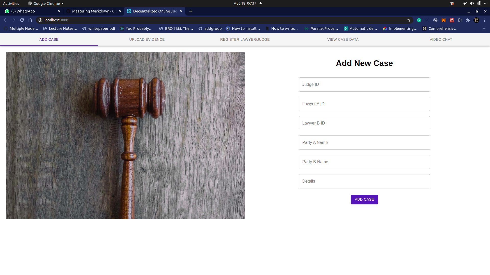
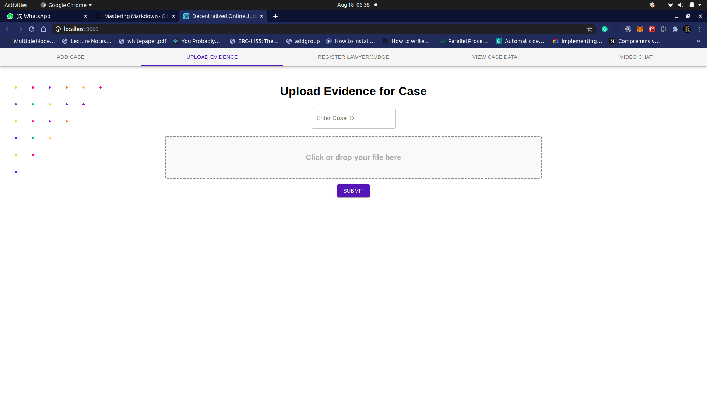
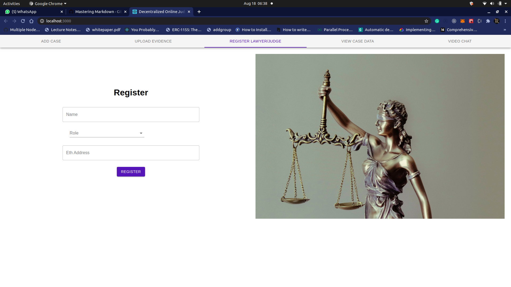
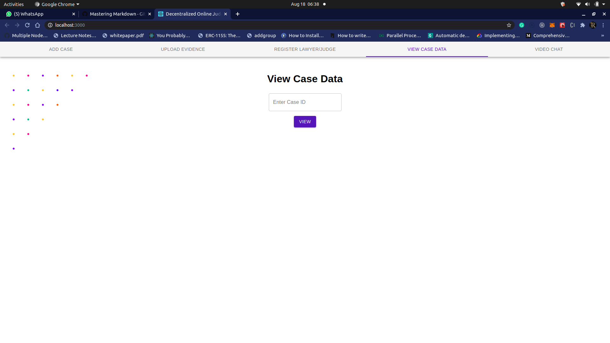
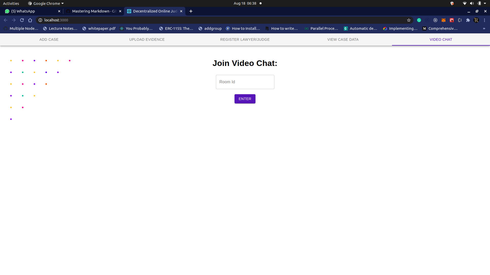
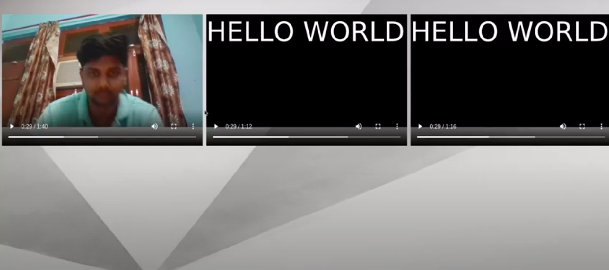

 
<h1><strong>E-Nyay</strong></h1>

### Justice Delayed is Justice Denied

## Our Solution

The project aims to achieve the following:

- No political interference
- Protection of life of witness.
- Saving money of the Concerned parties.
- A step towards Digitilzation.

### Other Advantages

- Witnesses related to criminal cases can go to the nearby district or high court where e-court rooms are already in place or to the it cell of the district magistrate’s office, and indian embassy in case of foreign nationals after getting it approved by the judge.
- Civil cases can be handled from home.
- Witness can give their statement from their home/any safe place while the prisoner’s statement can be recorded from the prison.
- A huge amount of money is spend when inmates are transported every year for court hearings. Our project will save around millions.
- Protection of a witness is very important but it comes with a huge cost, to protect just one witness for a year
- The police fir and the medical report will be availaible prior to the judges.
- It will prevent politicisation of any sort of such henious crimes.

## Stack

1. ReactJS
2. NodeJS
3. Socket.io
4. Solidity Smart Contracts
5. IPFS ( Filecoin )
6. Aave Protocol
7. Livepeer
8. Web3
9. Http Live Streaming
10. Matic

### Screenshots

[Video Demo](https://www.youtube.com/watch?v=-Ux4cLCmiz8)

- Add Case

  

- Upload Evidence

- Register Lawyer/Judge

- View Case Data

- Join Video Chat

- Liverpeer Video Call Room

### Contributors

- [Rachit Anand](https://github.com/rachit2501)
- [Apoorv Lathey](https://github.com/CodinMaster)

### Resources

- https://docs.google.com/presentation/d/1ejFbV4ovXGKpW6K9xK2VeX1_qOwLck2BAYNdVPru4y8/edit#slide=id.g8b49f488f7_0_21
- https://livepeer.com
- [https://github.com/livepeer/livepeerjs/tree/master/packages/sdk#broadcaster](https://github.com/livepeer/livepeerjs/tree/master/packages/sdk#broadcaster)
